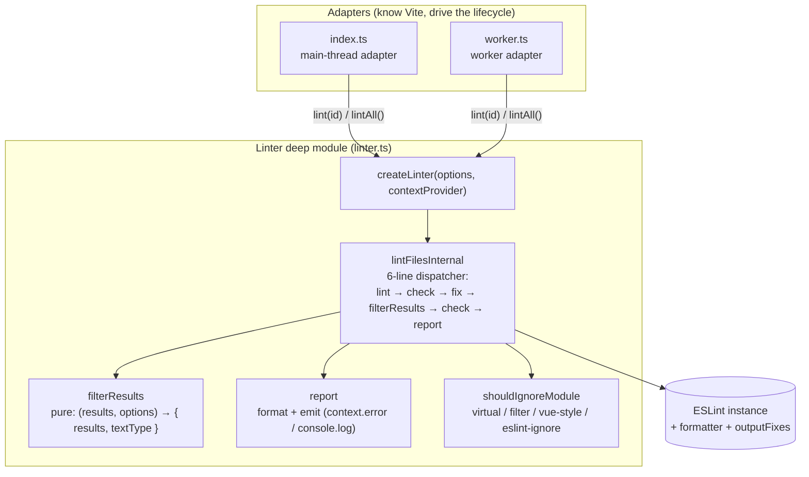

# Contributing to vite-plugin-eslint2

Thanks for your interest in contributing! This guide covers the architecture and how to set up a local development environment.

## Prerequisites

- Node.js `>=20.11.0` (or `>=21.2.0`)
- pnpm `>=10` (enforced via `only-allow`)
- ESLint v7 ~ v10 if you want to run the examples

## Local development

```sh
# 1. Clone and install
git clone https://github.com/ModyQyW/vite-plugin-eslint2.git
cd vite-plugin-eslint2
pnpm install

# 2. Start the core package in watch mode (builds dist/ on every change)
pnpm dev

# 3. In another terminal, run an example against the local build
pnpm -C examples/react-ts dev
# or: pnpm -C examples/react-ts build
```

The example links to the core package via `workspace:*`, so it consumes whatever is currently in `packages/core/dist/`. Keep `pnpm dev` running while you iterate.

### Useful scripts

| Command | Purpose |
| --- | --- |
| `pnpm dev` | Watch-build all packages |
| `pnpm build` | One-shot build (tsdown → `dist/`) |
| `pnpm type-check` | `tsc --noEmit` across the repo |
| `pnpm test` | Run vitest once |
| `pnpm fix` | Auto-fix formatting (Biome via ultracite) |
| `pnpm check` | Lint check without fixing |
| `pnpm docs:dev` | Run the VitePress docs site locally |

### Verifying a change

Before submitting a PR, run the full check locally — the same commands run in CI / git hooks:

```sh
pnpm fix && pnpm type-check && pnpm test && pnpm build
```

Then exercise the change against the example to confirm runtime behavior:

```sh
pnpm -C examples/react-ts build
```

## Architecture

The plugin runs ESLint on Vite-processed modules. The coordination lives in a single deep module (`Linter`), with two thin adapters driving it depending on the `lintInWorker` option.



### Module responsibilities

| Module | Role | Knows about |
| --- | --- | --- |
| `index.ts` | Main-thread adapter. Holds `worker` / `linter` / `currentContext`. Wires Vite hooks (`buildStart`, `transform`, `buildEnd`). | Vite plugin lifecycle, worker lifecycle |
| `worker.ts` | Worker adapter. Forwards `parentPort` messages to `linter.lint(id)`. ~25 lines. | Node `worker_threads` only |
| `linter.ts` | The deep module. Owns `createLinter`, `filterResults` (pure, exported for testing), `report`, `shouldIgnoreModule` (exported for testing), and all private collaborators. | ESLint only — no Vite/worker concepts |
| `utils.ts` | `getOptions` — normalizes user options into defaults. | Options shape only |

### Key design rules

- **The `Linter` is the only place that knows how to schedule one lint pass.** Adapters translate external worlds (Vite hooks, worker messages) into `lint(id)` / `lintAll()` calls — they never assemble `eslintInstance + formatter + outputFixes` themselves.
- **`contextProvider` is injected, not imported.** The main-thread adapter passes `() => currentContext` (updated per hook); the worker adapter passes `() => undefined`. This is the single seam where the two adapters diverge.
- **`filterResults` is pure.** `(results, options) → { results, textType }`, no I/O, no ESLint instance. It is the test surface for the filter/textType-flip logic. `report` (format + emit) stays private — its correctness is validated through `createLinter` and the example.
- **Plugin options and ESLint options share one namespace.** `ESLintPluginOptions extends ESLint.ESLint.Options`. The list in `getESLintConstructorOptions` (linter.ts) separates them by exclusion. **When you add a new plugin option, append its name to that list** — otherwise it is silently forwarded to the ESLint constructor and may collide with an ESLint option name (as `cache` does today, working only because ESLint recognises the same name).

### Adding a new plugin option

1. Add the field to `ESLintPluginOptions` / `ESLintPluginUserOptions` in `types.ts` with a bilingual JSDoc comment (match the existing style).
2. Set its default in `getOptions` (`utils.ts`).
3. **Append the field name to the exclusion list in `getESLintConstructorOptions`** (`linter.ts`). This step is easy to miss and fails silently.
4. If the option affects filtering or the textType decision, extend `filterResults` and add a test in `linter.test.ts`.

## Committing

- Pre-commit (`lefthook`) runs `ultracite fix` automatically. Pre-version also runs `fix`, `type-check`, and `test`.
- Commit messages follow [Conventional Commits](https://www.conventionalcommits.org/) (`feat:`, `fix:`, `refactor:`, `docs:`, `chore:`).
