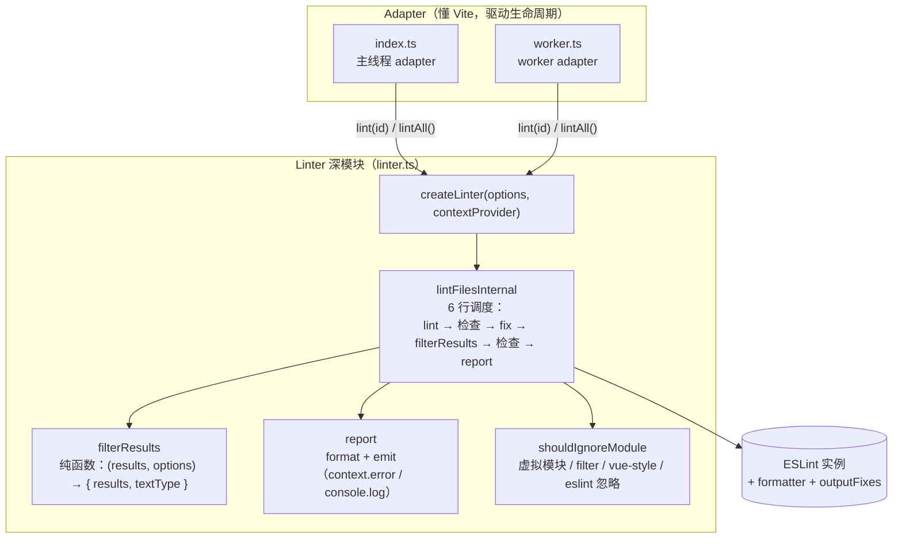

# 贡献 vite-plugin-eslint2

感谢你有兴趣贡献！本指南介绍项目架构和本地开发环境搭建。

## 前置条件

- Node.js `>=20.11.0`（或 `>=21.2.0`）
- pnpm `>=10`（通过 `only-allow` 强制）
- 如需运行示例，安装 ESLint v7 ~ v10

## 本地开发

```sh
# 1. 克隆并安装
git clone https://github.com/ModyQyW/vite-plugin-eslint2.git
cd vite-plugin-eslint2
pnpm install

# 2. 以 watch 模式启动核心包（每次改动重新构建 dist/）
pnpm dev

# 3. 在另一个终端，用本地构建产物跑示例
pnpm -C examples/react-ts dev
# 或：pnpm -C examples/react-ts build
```

示例通过 `workspace:*` 链接到核心包，消费的是 `packages/core/dist/` 里的当前产物。迭代时请保持 `pnpm dev` 持续运行。

### 常用脚本

| 命令 | 用途 |
| --- | --- |
| `pnpm dev` | watch 构建所有包 |
| `pnpm build` | 一次性构建（tsdown → `dist/`） |
| `pnpm type-check` | 全仓库 `tsc --noEmit` |
| `pnpm test` | 跑一次 vitest |
| `pnpm fix` | 自动修格式（Biome，经 ultracite） |
| `pnpm check` | 仅检查不修复 |
| `pnpm docs:dev` | 本地运行 VitePress 文档站点 |

### 验证改动

提交 PR 前在本地跑完整检查——与 CI / git hooks 跑的是同一套：

```sh
pnpm fix && pnpm type-check && pnpm test && pnpm build
```

再针对示例跑一次，确认运行时行为：

```sh
pnpm -C examples/react-ts build
```

## 架构

插件对 Vite 处理的模块运行 ESLint。调度逻辑集中在一个深模块（`Linter`）里，由两个轻量 adapter 按 `lintInWorker` 选项分别驱动。



### 模块职责

| 模块 | 角色 | 知晓的概念 |
| --- | --- | --- |
| `index.ts` | 主线程 adapter。持有 `worker` / `linter` / `currentContext`，接 Vite 钩子（`buildStart`、`transform`、`buildEnd`）。 | Vite 插件生命周期、worker 生命周期 |
| `worker.ts` | worker adapter。把 `parentPort` 消息转发给 `linter.lint(id)`。约 25 行。 | 仅 Node `worker_threads` |
| `linter.ts` | 深模块。包含 `createLinter`、`filterResults`（纯函数，导出供测试）、`report`、`shouldIgnoreModule`（导出供测试）及全部私有协作函数。 | 仅 ESLint——不感知 Vite/worker |
| `utils.ts` | `getOptions`——把用户选项归一化为默认值。 | 仅选项形状 |

### 关键设计规则

- **`Linter` 是唯一知道"如何调度一次 lint"的地方。** Adapter 把外部世界（Vite 钩子、worker 消息）翻译成 `lint(id)` / `lintAll()` 调用——它们绝不自己拼装 `eslintInstance + formatter + outputFixes`。
- **`contextProvider` 是注入的，不是 import 的。** 主线程 adapter 传 `() => currentContext`（每个钩子里更新）；worker adapter 传 `() => undefined`。这是两个 adapter 分歧的唯一接缝。
- **`filterResults` 是纯函数。** `(results, options) → { results, textType }`，无 I/O、无 ESLint 实例。它是 filter/textType 翻转逻辑的测试面。`report`（format + emit）保持私有——其正确性通过 `createLinter` 和示例验证。
- **plugin 选项与 ESLint 选项共享同一命名空间。** `ESLintPluginOptions extends ESLint.ESLint.Options`。`getESLintConstructorOptions`（linter.ts）里的列表用排除法分离两者。**新增 plugin 选项时，必须把字段名追加进这个列表**——否则它会被静默透传给 ESLint 构造器，可能与 ESLint 选项名撞车（如当前的 `cache`，只是因为 ESLint 认同名字且语义兼容才碰巧工作）。

### 新增一个 plugin 选项

1. 在 `types.ts` 的 `ESLintPluginOptions` / `ESLintPluginUserOptions` 里加字段，配双语 JSDoc 注释（与现有风格一致）。
2. 在 `getOptions`（`utils.ts`）里设默认值。
3. **把字段名追加进 `getESLintConstructorOptions`（`linter.ts`）的排除列表。** 这一步最容易漏，且失败是静默的。
4. 若选项影响过滤或 textType 决策，扩展 `filterResults` 并在 `linter.test.ts` 加测试。

## 提交

- pre-commit（`lefthook`）会自动跑 `ultracite fix`。pre-version 还会跑 `fix`、`type-check`、`test`。
- 提交信息遵循 [Conventional Commits](https://www.conventionalcommits.org/)（`feat:`、`fix:`、`refactor:`、`docs:`、`chore:`）。
